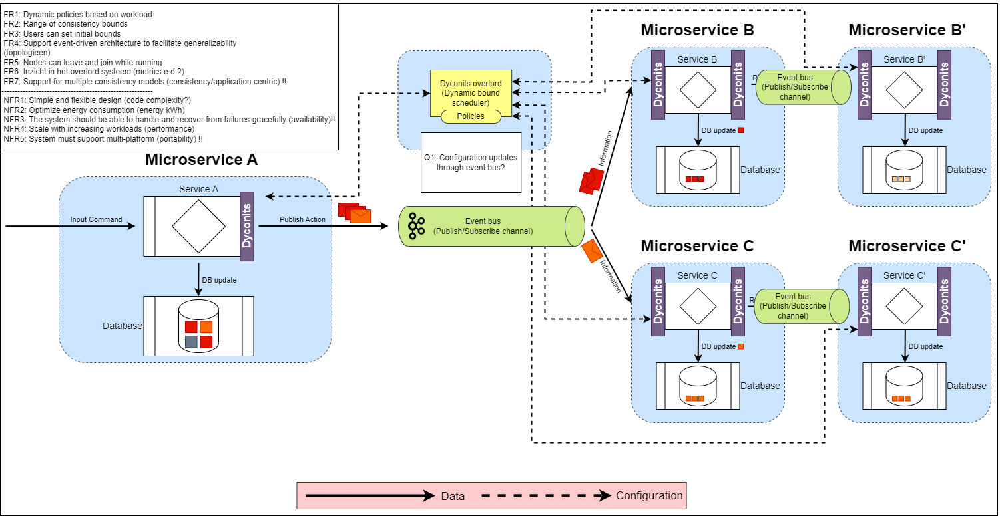

# Generic Dyconits in Different Topologies in .NET
This Github repository contains the code for the thesis on "Generic Dyconits in Different Topologies" by Jurre Brandsen. The code is implemented in .NET

## Architecture


## Author
Jurre Brandsen (Github username: JurreBrandsen1709) is the author of this thesis code.

## Folder Structure
* a-b_config: Contains the Consumer and Producer applications along with their associated files, such as the Dockerfile and statistics.json files.
* Dyconit: Contains the source code for the Overlord, Producer, and Consumer applications along with their associated files.
* Policies: Contains JSON files that define the policies used by the applications.
* wip: Contains subfolders with various configurations for the Producer and Consumer applications.

## Getting Started
### Prerequisites
*.NET Core SDK version 3.0 or later
* Confluent.Kafka version 1.9.3

### Installation
1. Install .NET SDK: Make sure you have .NET SDK installed on your machine. You can download the latest version of .NET SDK from the official Microsoft website.

1. Clone the repository: Clone the repository to your local machine using Git.

1. Build the project: Navigate to the directory containing the project and run dotnet build command to build the project.

1. Install dependencies: If the project has any dependencies listed in the .csproj files, make sure to install them using the appropriate package manager (e.g., NuGet, dotnet CLI).

1. Run the project: Once the project is built successfully, you can run it using the dotnet run command.

### Usage
1. Run `docker-compose up` to start the Kafka cluster.
1. Navigate to the `Dyconit` folder.
1. Run `dotnet run` to start the Overlord application.
1. Navigate to the `a-b_config\Producer` folder in a new terminal.
1. Run `dotnet run` to start the Consumer application.

You can now send messages to the Kafka cluster using the Producer application. The Consumer application will consume the messages and send them to the Overlord application. The Overlord application will then process the messages according to the policy defined in the `Policies` folder.

### Examples
```bash
- Dyconit overlord started.
-- Received newAdminEvent message. Admin client listening on port 6703.
--- Added dyconit collection 'Transactions' to the dyconit collections.
--- Added new admin client listening on port '6703' to dyconit collection 'Transactions'.
--- Added bounds to dyconit collection 'Transactions'.
--- Bounds: [Staleness, 50000], [OrderError, 50], [NumericalError, 3]
--- Current dyconit collections:
---- Collection: Transactions
---- Ports: 6703
---- Bounds: [Staleness, 50000], [OrderError, 50], [NumericalError, 3]
-- Received newAdminEvent message. Admin client listening on port 9842.
--- Dyconit collection 'Transactions' already exists.
--- Added new admin client listening on port '9842' to dyconit collection 'Transactions'.
--- Bounds for dyconit collection 'Transactions' already exist.
--- Bounds: [Staleness, 50000], [OrderError, 50], [NumericalError, 3]
--- Current dyconit collections:
---- Collection: Transactions
---- Ports: 6703, 9842
---- Bounds: [Staleness, 50000], [OrderError, 50], [NumericalError, 3]
```